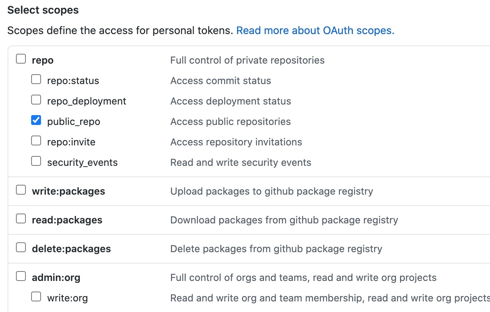

# Github Live 3vents Stream

link: [3vents.github.io](https://3vents.github.io)

A website that shows current edits on github **globally** and **right now**.

## Usage

To use it you must first create a *github access token*. 

You do that by following these steps:

1. Go to [https://github.com/settings/tokens](https://github.com/settings/tokens)
2. Click **Generate new token**
3. Checkmark the **public_repo Access public repositories** option under **repo**, it should look like this:

4. Now give your token a name
5. Press **Generate token**
6. Copy the token and put it in [3vents.github.io](https://3vents.github.io)